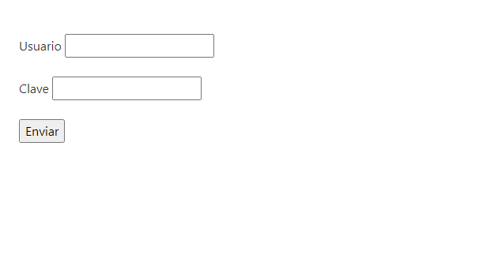
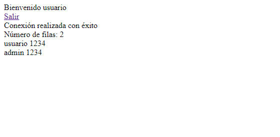

# SESIONES en PHP y BASES de DATOS RELACIONALES

Las sesiones son utilizadas en PHP para asociar las diferentes peticiones (inicialmente independientes) de un cliente al servidor. Al iniciar una sesión el servidor asigna y envía al usuario un identificador de sesión, para que así en las siguientes peticiones se envíe ese identificador y el servidor sepa que es el mismo usuario.

Para crear una sesión se utilizan: la función **start_session()** y la variable superglobal **$_SESSION**; de forma que los sripts que compartan sesión también compartirán información.

- La sintaxis es $_SESSION["nombre]=valor;

Para no crear los archivos sin framework ni librerías de estilo se va a utilizar este [repositorio de Github](https://github.com/twbs/bootstrap-npm-starter) como esqueleto de la aplicación, ya que incluye bootstrap con npm.

Es decir, tras crear un proyecto en blanco, se clona o trae todo ese contenido a mi proyecto y se corren los siguientes comandos para la instalación:

- npm i + npm audit fix
- npm run css-compile
- npm run watch
- npm run server
- npm start -> al abrir [localhost:3000](http://localhost:3000) se muestra la página (que de momento es un template)

A partir de aquí podremos crear nuestro proyecto de sesiones en PHP. Creamos una serie de archivos php con la indicación de iniciar sesión y el código correspondiente:

- uso_basico_1.php
- uso_basico_2.php
- login.php (archivo ampliado de otro de un apartado anterior, incluye la vista html y la conexión con los estilos)
- principal_1.php
- logout.php

RESULTADOS: localhost no recibe login.php (y sin el index.html de template no se muestra el formulario, sino el árbol de diretorios). Al abrir el proyecto por laragon sí se puede acceder a la pantalla de login y no hay problema en enviar tanto el usuario como la contraseña, recibirlos por pantalla y mediante el enlace "salir" vover a la página de login.

## Conexión con base de datos relacional (mySQL)

En este apartado se han creado una serie de archivos con la finalidad de visualizar el código necesario para la conexión y la realización de funciones con PHP y una base de datos relacional, y son los siguientes:

- conexion.php (conexión a la base de datos)
- funcion_1 (recuperación y presentación de datos)
- funcion_2 (inserción, borrado y actualización)
- funcion_3 (transacciones)

Al crear el proyecto en laragon ya contamos con una base de datos en phpmyadmin, en la que insertamos la siguiente tabla y fila en ella:

CREATE TABLE `usuarios` (
  `codigo` int(3) NOT NULL AUTO_INCREMENT,
  `nombre` varchar(16) NOT NULL,
  `clave` varchar(16) NOT NULL,
  `rol` tinyint(1) NOT NULL,
  PRIMARY KEY (`codigo`),
  UNIQUE KEY `nombre` (`nombre`),
  UNIQUE KEY `codigo` (`codigo`)
) ENGINE=InnoDB AUTO_INCREMENT=1 DEFAULT CHARSET=utf8;

INSERT INTO usuarios VALUES (1,"usuario","1234",0);
INSERT INTO usuarios VALUES (2,"admin","1234",1);

Una vez hecho todo esto, cuando insertamos en los campos de login uno de los usuarios y su contraseña conseguimos por pantalla varias cosas: un mensaje de bienvenida, un botón de salir (volver al login), un mensaje de "conexión realizada con éxito", el número de filas que tiene la tabla "usuarios" y los propios nombres y claves de esa tabla.

## Páginas finales

Por último se crea el repositorio Github para guardar el proyecto.

## Extra: base de datos con el archivo crear.sql.sql vía phpmyadmin

- Obtención del archivo y copia del mismo en este proyecto para su guardado
- Importación del archivo en phpmyadmin, se crean las bases de datos y todas sus tablas
  - doctrine (empleado, empleado_proyectos, equipo, jugador, partido, proyecto)
  - empresa (departamentos, empleados, usuarios)
  - pedidos (categorias, pedidos, pedidosproductos, productos, restaurantes)
- Todo esto se utilizará en futuros ejercicios de php

Como prueba, conectamos este proyecto con la nueva base creada "empresa", y nos salen por pantalla los datos de esa tabla "usuarios", como se puede ver aquí:

